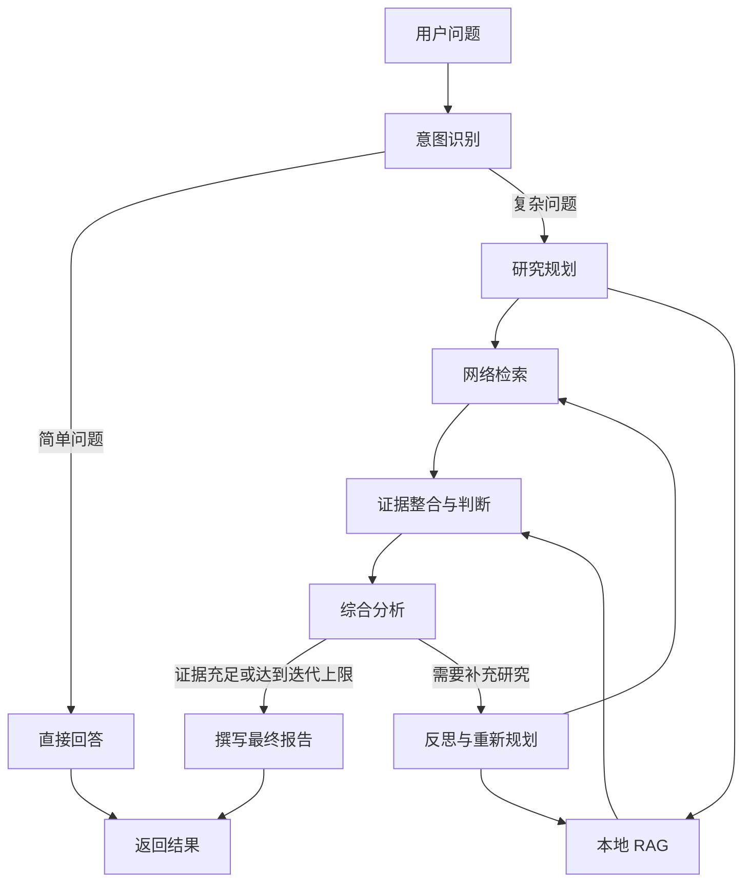

# DeepResearch

一个基于 LangGraph 与通义千问构建的多智能体深度研究助手。

DeepResearch 能够根据问题复杂度自动选择快速回答或深度研究路径，并结合网络检索、本地 RAG、证据分析和会话记忆，生成结构化研究结果。项目同时提供命令行入口、FastAPI 接口和 Vue Web 界面。

> 项目目前处于开发阶段，适合用于学习和验证多智能体编排、检索增强生成与研究型 Agent 工作流。

## 核心特性

- **智能意图路由**：简单问题直接回答，复杂问题自动进入完整研究流程。
- **多智能体协作**：通过规划、检索、证据判断、分析、反思和写作等角色分工完成研究任务。
- **双路并行检索**：并行执行网络搜索和本地知识库检索，缩短研究链路。
- **本地 RAG**：支持将 TXT、Markdown 和 PDF 文档切分并写入 Milvus。
- **迭代式研究**：分析阶段发现证据不足时，可重新规划并补充检索。
- **会话记忆**：支持短期记忆、长期记忆和 LangGraph Checkpointer，可按需使用 PostgreSQL、Redis 或内存后端。
- **流式输出**：FastAPI 提供基于 SSE 的执行状态和最终结果推送。
- **多种使用入口**：支持命令行、REST API 和 Vue 3 Web 界面。

## 工作流程



## 技术栈

| 模块 | 技术 |
| --- | --- |
| 智能体编排 | LangGraph、LangChain |
| 大语言模型 | 通义千问（DashScope） |
| 后端服务 | FastAPI、Uvicorn |
| 前端界面 | Vue 3、TypeScript、Vite |
| 向量检索 | Milvus、DashScope Embedding |
| 状态与记忆 | PostgreSQL、Redis、SQLite、内存 |
| 文档解析 | PyPDF |

## 环境要求

- Python 3.10 或更高版本
- Node.js 20.19+ 或 22.12+
- npm
- 推荐使用 [uv](https://docs.astral.sh/uv/) 管理 Python 依赖
- 一个可用的 DashScope API Key
- 可选：博查 Web Search API Key、Milvus、PostgreSQL、Redis

## 快速开始

### 1. 获取项目并安装后端依赖

```bash
git clone https://github.com/2021010740135/deep_research.git
cd deep_research
uv sync
```

如果不使用 uv，也可以创建虚拟环境后执行：

```bash
pip install -r requirements.txt
```

### 2. 配置环境变量

复制示例配置：

```bash
cp .env.example .env
```

Windows PowerShell：

```powershell
Copy-Item .env.example .env
```

至少填写 DashScope API Key：

```dotenv
DASHSCOPE_API_KEY=你的_DashScope_API_Key
BOCHA_API_KEY=你的_博查_API_Key
```

`BOCHA_API_KEY` 仅用于网络检索；不配置时，系统会跳过网络搜索。

若暂时不使用外部记忆和本地 RAG，可使用轻量配置：
